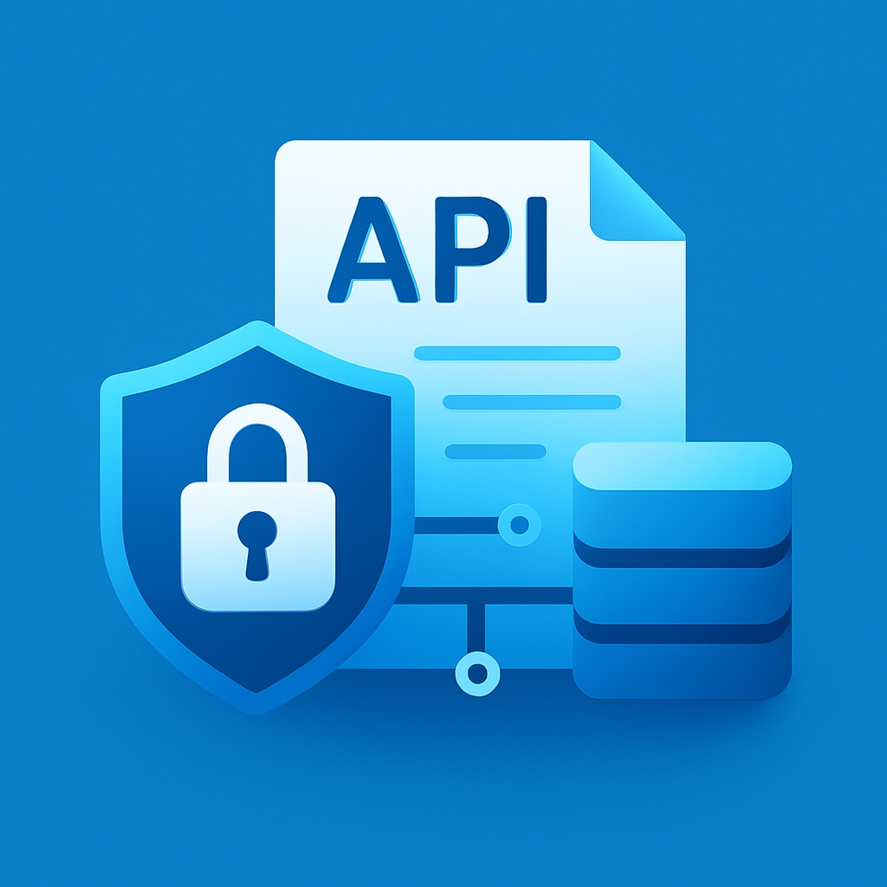

<div align="center">
  

  # API Documenter

  **The ultimate self-hosted, offline-first API testing and documentation platform.**

  [](LICENSE)
  [](package.json)
  [](CONTRIBUTING.md)
  [](#)
</div>

---

## 🌟 Overview

**API Documenter** is a robust alternative to Postman and Insomnia, designed specifically for developers who value privacy, speed, and ownership. It starts as a high-performance local desktop app but scales instantly into a team-oriented platform with secure database synchronization and granular role-based access control.

## 🚀 Key Features

### 1. Offline-First Excellence
- **Local Storage**: Your sensitive API data stays on your machine by default using high-speed IndexedDB (Dexie).
- **Zero Latency**: No "cloud sync" lag while you're prototyping or testing locally.
- **Privacy by Design**: No mandatory accounts or telemetry.

### 2. Secure Team Synchronization
- **Multi-DB Support**: Connect your workspace to a remote **PostgreSQL** or **MySQL** server.
- **Vercel Proxy Deployment**: Deploy a production-ready server to Vercel in one click. This ensures your DB credentials are never exposed to the client side and all team traffic is securely authorized.
- **Real-time Sync**: Collaborative editing with bi-directional synchronization between local and remote states.

### 3. Folder-Level RBAC
- **Admin**: Full control over project infrastructure, sync settings, and team management.
- **Editor**: Full read/write access to folders, requests, and documentation.
- **Viewer**: Read-only access for team members who need to consume documentation without modification.

### 4. Advanced Request Engine
- **Full HTTP Support**: GET, POST, PUT, DELETE, PATCH, OPTIONS, and more.
- **Rich Payloads**: Seamlessly handle Headers, Query Params, and JSON/Text bodies.
- **Smart Response Viewer**: Real-time status codes, response headers, body size, and execution benchmarks.

### 5. Enterprise-Grade Scaling
- **Premium UI**: Sleek, glassmorphic dark-themed design.
- **Custom Font Scaling**: Perfectly tailored readability for any screen size, from laptop screens to 4K monitors.
- **GitHub Auto-Updates**: Silent background updates that keep you on the latest version without disruption.

## 🛠️ Tech Stack

- **Frontend**: React 18, TypeScript, Vite
- **Desktop Layer**: Electron (Standard IPC Integration)
- **State Management**: Zustand & React Query
- **Local Database**: Dexie (IndexedDB)
- **Remote Bridge**: mysql2, pg (via Secure Proxy)
- **CI/CD**: GitHub Actions & Electron-Builder

## � Getting Started

### Prerequisites
- [Node.js](https://nodejs.org/) (v18.x or v20.x recommended)
- [npm](https://www.npmjs.com/)

### Installation & Setup

1. **Clone the repository:**
   ```bash
   git clone https://github.com/PraneethKulukuri26/API-Documenter.git
   cd API-Documenter
   ```

2. **Install dependencies:**
   ```bash
   npm install
   ```

3. **Start Development Server:**
   ```bash
   npm run dev
   ```

4. **Build Production Application:**
   ```bash
   # Build for Windows
   npm run build:win

   # Build for macOS
   npm run build:mac
   ```

## 🛡️ Security

API Documenter uses a unique **Security Proxy Architecture**. When you connect a database, the app deploys a serverless function to Vercel. This function acts as the sole gatekeeper for your database, ensuring that raw SQL credentials are never stored in the desktop application but remain securely in your Vercel environment variables.

For more details, see [SECURITY.md](SECURITY.md).

## 🤝 Contributing

We love contributions! Please read our [CONTRIBUTING.md](CONTRIBUTING.md) to get started.

## 📄 License

Distributed under the MIT License. See [LICENSE](LICENSE) for more information.

---

<!-- <div align="center">
  Built with ❤️ by <a href="https://github.com/PraneethKulukuri26">Praneeth Kulukuri</a>
</div> -->